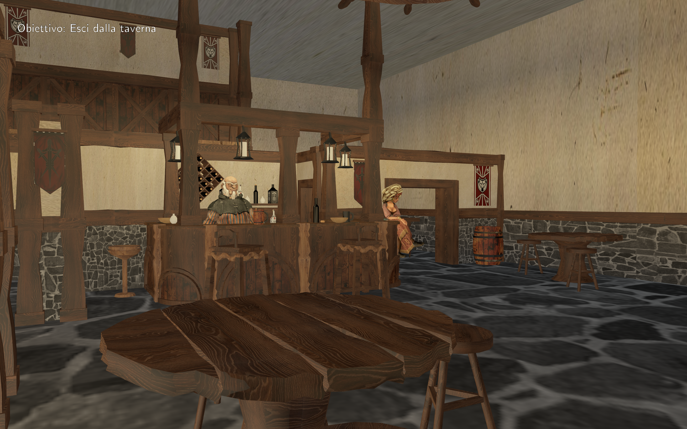
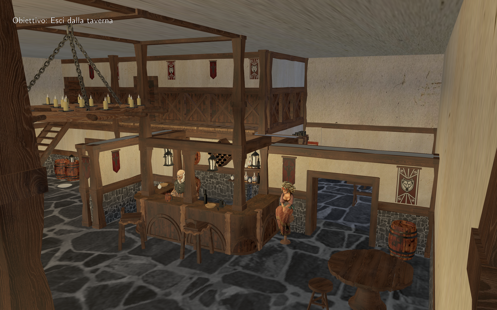
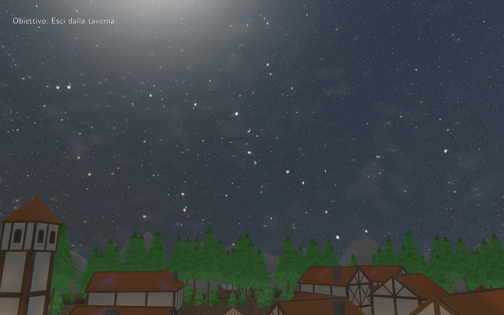
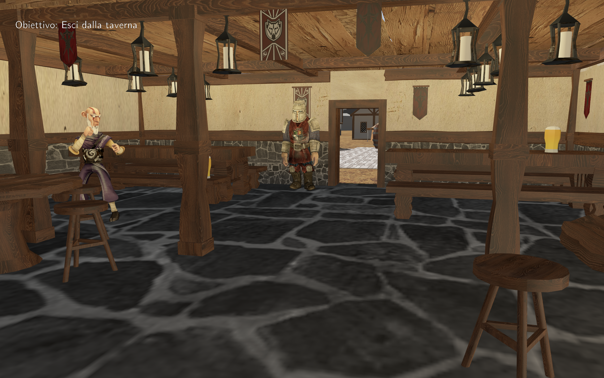

# 🏰 Dungeon Tavern

> A custom 3D game and graphics engine built from scratch using **C++** and the low-level **Vulkan API**.



---

## ✨ Key Features

* **Multi-Pass Rendering & Shadow Mapping:** Implements a two-pass rendering pipeline featuring a dedicated Depth-Only Shadow Pass (from the sun's perspective) combined with a Blinn-Phong lighting model.
* **Skeletal Animation & Skinning:** Full support for 3D animated characters (Player and NPCs) using vertex skinning, joint weights, and matrix palette updates calculated frame-by-frame.
* **GPU-Driven Optimization (Distance & Room Culling):** Dynamic spatial culling utilizing a "zero matrix" technique to discard hidden or distant geometry instantly on the GPU without costly buffer re-allocations.
* **Interactive Game World:** 
  * Interactive dialogue system with NPCs.
  * Physics-based object throwing and collision detection (`PhysicsManager`).
  * Quest and mission tracking system (`MissionManager`).
  * Day/night cycle and dynamic lighting management (`LightManager`).
* **Dual Input Support:** Fully compatible with both **Keyboard/Mouse** and standard **Gamepads** (via GLFW joystick mapping).

---

## 🎮 Controls

### ⌨️ Keyboard & Mouse
| Key | Action |
| :--- | :--- |
| **W, A, S, D** | Movement |
| **Shift** | Run |
| **Space** | Jump |
| **E** | Interact / Dialogue |
| **Q** | Pick up / Drop Objects |
| **M** | Fly mode |
| **C / X** | Camera mode toggle (1st / 3rd person) |
| **R** | Toggle Fullscreen / Borderless |
| **L** | Toggle Shadows on/off |
| **ESC** | Exit Game |

### 🎮 Gamepad
| Button | Action |
| :--- | :--- |
| **Left Stick / D-Pad** | Movement / Menu Navigation |
| **L3 / RT** | Run |
| **Button A** | Jump / Interact / Confirm |
| **Button X** | Pick up / Drop Objects |
| **Button Y** | Fly mode |
| **Back Button** | Toggle Fullscreen |

---

## 🛠️ Technical Stack & Architecture

* **Language:** C++
* **Graphics API:** Vulkan (Custom pipelines, Descriptor Sets, UBOs, Command Buffers)
* **Windowing & Input:** GLFW
* **Math Library:** GLM (OpenGL Mathematics)
* **Data Parsing:** nlohmann/json (`json.hpp`)
* **Asset Loading:** `stb_image` and custom GLTF model parsing pipelines.

---

## 🚀 Getting Started

### Prerequisites
Make sure you have the following installed on your system:
* A modern GPU supporting **Vulkan 1.2+**
* **Vulkan SDK**
* **CMake** (3.15 or higher)
* A C++ compiler supporting C++17 or later.

### Build & Run
1. Clone the repository:
   ```bash
   git clone https://github.com/Marcoscianna/DungeonTavern
   cd DungeonTavern

### Preview

<p align="center">
  
  
  
</p>
